<div align="center">

# WritBase

**MCP-native task management for AI agent fleets**

A control plane for AI agents and human supervisors. Persistent task registry with scoped permissions, inter-agent delegation, and full provenance — all accessible via MCP.

[](LICENSE)
[](https://github.com/Writbase/writbase/actions)
[](https://modelcontextprotocol.io)

<br/>



</div>

---

## Why WritBase?

AI agents need a shared, persistent task registry — not ephemeral in-memory state that vanishes between sessions. WritBase gives your agent fleet:

- **One source of truth** — Tasks live in Postgres, not scattered across files and chat threads
- **Scoped permissions** — Each agent gets exactly the access it needs, nothing more
- **Full provenance** — Every change is recorded: who, what, when, and why
- **Inter-agent delegation** — Agents can assign tasks to each other with depth limits and cycle detection
- **MCP-native** — Agents connect via the Model Context Protocol, no custom integration needed

## Getting Started

### Option A: CLI Setup (recommended)

No repo clone needed. Just `npx`:

```bash
npx writbase init        # Interactive setup — configures Supabase credentials
npx writbase migrate     # Apply database schema
npx writbase key create  # Create your first agent key
```

That's it. Your MCP endpoint is live at:

```
https://<project-ref>.supabase.co/functions/v1/mcp-server/mcp
```

> **Prerequisites**: Node 18+, [Supabase CLI](https://supabase.com/docs/guides/cli), a Supabase project ([free tier](https://supabase.com/pricing) works)
>
> Deploy the Edge Function: `npx supabase functions deploy mcp-server --no-verify-jwt`
>
> See the [CLI README](cli/README.md) for all commands.

### Option B: Manual Setup

<details>
<summary>Clone and deploy manually</summary>

```bash
git clone https://github.com/Writbase/writbase.git
cd writbase && npm install

# Create a free project at supabase.com/dashboard, then:
npx supabase link --project-ref <your-project-ref>
npx supabase db push
npx supabase functions deploy mcp-server --no-verify-jwt
```

> **Optional dashboard**: `cp .env.example .env.local` → edit with your Supabase URL + anon key → `npm run dev`
>
> See the [Deployment Guide](docs/deployment.md) for Vercel hosting and self-hosted Supabase.

</details>

### 2. Create a project and agent key

Via the CLI (`npx writbase key create`), the dashboard, or a manager agent:

1. **Create a project** — e.g., `my-app`. Optionally add departments (`backend`, `frontend`, `devops`)
2. **Create an agent key** — name it, pick the `worker` role, save the key (`wb_<key_id>_<secret>` — shown once)
3. **Grant permissions** — `writbase key permit my-agent --grant --project my-app --can-read --can-create --can-update` (or via dashboard)

### 3. Connect your MCP client

<details>
<summary><strong>Claude Code</strong></summary>

```bash
claude mcp add writbase \
  --transport http \
  --url https://<project-ref>.supabase.co/functions/v1/mcp-server/mcp \
  --header "Authorization: Bearer wb_<key_id>_<secret>"
```
</details>

<details>
<summary><strong>Cursor</strong></summary>

Add to `.cursor/mcp.json`:

```json
{
  "mcpServers": {
    "writbase": {
      "type": "streamableHttp",
      "url": "https://<project-ref>.supabase.co/functions/v1/mcp-server/mcp",
      "headers": { "Authorization": "Bearer wb_<key_id>_<secret>" }
    }
  }
}
```
</details>

<details>
<summary><strong>VS Code / Copilot</strong></summary>

Add to `.vscode/mcp.json`:

```json
{
  "servers": {
    "writbase": {
      "type": "http",
      "url": "https://<project-ref>.supabase.co/functions/v1/mcp-server/mcp",
      "headers": { "Authorization": "Bearer wb_<key_id>_<secret>" }
    }
  }
}
```
</details>

<details>
<summary><strong>Windsurf / Claude Desktop / Other</strong></summary>

See the [MCP Config Reference](docs/mcp-config-reference.md) for all supported clients.
</details>

### 4. Use it

Ask your agent:

```
"Check my WritBase permissions"          → calls info
"Create a task in my-app: Fix login bug" → calls add_task
"Mark it as in_progress"                 → calls update_task (with version for concurrency)
"Show all high priority tasks"           → calls get_tasks with priority filter
```

### 5. Scale up

| Agent | Role | Scoped to | Use case |
|-------|------|-----------|----------|
| `ci-bot` | worker | `my-app/devops` — can_create | CI creates tasks on build failure |
| `triage-agent` | worker | `my-app` (all depts) — can_comment | Reviews tasks, adds notes |
| `ops-manager` | manager | (workspace-wide) | Manages keys, permissions, projects |

Each agent gets its own key with exactly the permissions it needs — nothing more.

> **Full walkthrough**: [Getting Started Guide](docs/quickstart.md) — permissions, departments, troubleshooting

## MCP Tools

### Worker Tools (all agents)

| Tool | Description |
|------|-------------|
| `info` | Agent identity, permissions, and system metadata |
| `get_tasks` | List tasks with filtering, pagination, and full-text search |
| `add_task` | Create a task in permitted scope |
| `update_task` | Update a task with optimistic concurrency control |

### Manager Tools (manager agents only)

| Tool | Description |
|------|-------------|
| `manage_agent_keys` | Create, update, deactivate, rotate agent keys |
| `manage_agent_permissions` | Grant/revoke permissions with subset enforcement |
| `get_provenance` | Query the append-only audit log |
| `manage_projects` | Create, rename, archive projects |
| `manage_departments` | Create, rename, archive departments |
| `subscribe` | Register webhooks for task event notifications |
| `discover_agents` | Find agents by capability and skill |

## Features

- **Multi-tenant workspaces** — Signup auto-provisions an isolated workspace
- **Dynamic MCP schema** — Tool visibility and parameter enums adapt per agent's role and permissions
- **6 permission types** — `can_read`, `can_create`, `can_update`, `can_assign`, `can_comment`, `can_archive`
- **Project + department scoping** — Permissions are granted per (project, department) pair
- **Optimistic concurrency** — Version-based conflict detection prevents silent overwrites
- **Cursor pagination** — Efficient traversal of large task sets
- **Rate limiting** — Per-agent-key request throttling
- **Request logging** — Every MCP call logged with latency, status, and agent context

## Architecture

```
┌─────────────┐     ┌──────────────────┐     ┌──────────────┐
│  MCP Client │────▶│  Edge Function   │────▶│   Postgres   │
│  (Agent)    │◀────│  (Hono + MCP SDK)│◀────│  (Supabase)  │
└─────────────┘     └──────────────────┘     └──────────────┘
                           │
                    ┌──────┴──────┐
                    │  Next.js 16 │
                    │  Dashboard  │
                    └─────────────┘
```

- **Backend**: Supabase (Postgres + Edge Functions with Deno runtime)
- **Transport**: Streamable HTTP (MCP SDK)
- **Frontend**: Next.js 16 (App Router) + Tailwind CSS
- **Auth**: Supabase Auth (humans) + SHA-256 agent keys (agents)

## Deployment Options

| | Supabase Cloud (recommended) | Self-Hosted Supabase |
|---|---|---|
| Setup | `npx writbase init` → `npx writbase migrate` → done | Docker Compose (5 containers) |
| Cost | [Free tier](https://supabase.com/pricing): 500MB DB, 50K MAUs | Your infrastructure |
| Dashboard | Deploy to Vercel (free) | Self-host Next.js |
| Updates | Automatic platform updates | Manual |
| Control | Supabase-managed | Full |

See [docs/deployment.md](docs/deployment.md) for detailed setup instructions.

## Documentation

- [Getting Started](docs/quickstart.md) — Deploy, create an agent key, connect your MCP client, and manage tasks
- [CLI Reference](cli/README.md) — `npx writbase init`, `migrate`, `key`, `status`
- [Deployment Guide](docs/deployment.md) — Supabase Cloud, Vercel, and self-hosted setup
- [Core Concepts](docs/concepts.md) — Permissions, provenance, error codes, delegation
- [MCP Config Reference](docs/mcp-config-reference.md) — Client configs for Claude Code, Cursor, VS Code, Windsurf

## Contributing

See [CONTRIBUTING.md](CONTRIBUTING.md) for development setup, testing, and PR guidelines.

## Security

See [SECURITY.md](SECURITY.md) for vulnerability reporting.

## License

Apache 2.0 — see [LICENSE](LICENSE).
